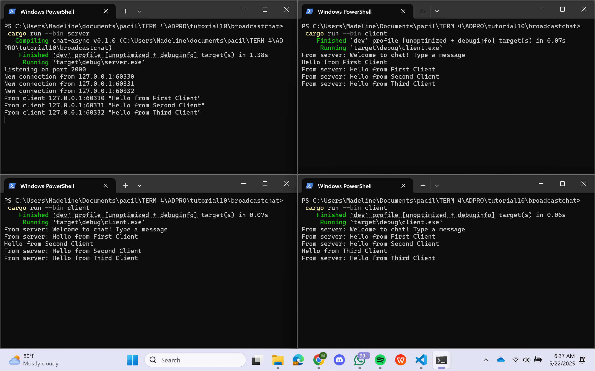

# Tutorial 10 Pemrograman Lanjut: Broadcast Chat
### Madeline Clairine Gultom - 2306207846 - ADPRO A

## Original Code, run one server + three clients
Sesuai dengan namanya, yaitu broadcast chat, maka ketika satu client mengirimkan pesan, semua client lain akan menerima pesan tersebut, termasuk pengirimnya sendiri. Pertama-tama, saya menjalankan satu server dengan perintah `cargo run --bin server`, lalu menjalankan tiga client dengan perintah `cargo run --bin client`. Meskipun semua client berasal dari alamat IP yang sama (127.0.0.1), masing-masing memiliki port berbeda yang secara otomatis ditentukan oleh sistem operasi saat membuat koneksi ke server. Semua client dapat menerima pesan satu sama lain karena server menggunakan channel broadcast `(tokio::sync::broadcast)`. Setiap kali client baru terhubung, server membuat subscriber baru `(bcast_rx = bcast_tx.subscribe())` untuk channel tersebut. Ketika server menerima pesan dari satu client, pesan tersebut disebarkan ke semua subscriber, yaitu semua client yang terhubung melalui `bcast_rx`, termasuk client pengirim itu sendiri.
